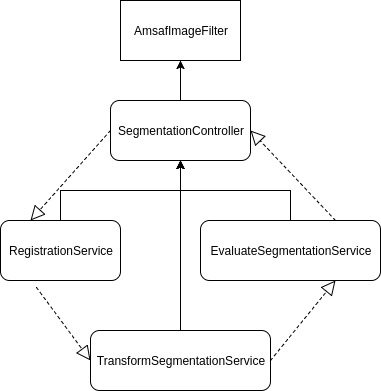

# Automated MRI Segmentation and Analysis Framework \(AMSAF\)

Further documentation contained here: 
https://iancmcdonald.gitbooks.io/amsaf/content/
---

## Meta:

**Goal:** Automate the generation and testing of MRI segmentations

**High-level implementation: **Grid search over the Elastix parameter space, constrained by our prior intuition and experience.

**Tools:** Python, Elastix, SimpleElastix

**Thoughts to keep in mind**:

* Time constraints
* Each registration + segmentation takes a few minutes to complete
* Space constraints:
* Each image takes up a significant amount of space, sometimes up to 500MB
* Modularity:

* As this project evolves, we may replace components of this framework to fit new insights or tools. For instance, we should not write this in such a way that we could easily replace Elastix for another registration framework like ANTs

* Each piece is sufficiently complex so as to warrant component-level unit testing

* Abstraction and ease of use:

* People years from now might want to use this, so write with them in mind

* Abstract away low-level implementation details without sacrificing results

---

## High-Level Components:

### 

###

### Segmenter

* Purpose: Automatically Segment MRI images
* Implementation: Registration-based segmentation parameterized by target and manually segmented reference images. This should be flexible enough to accommodate switching out registration tools and frameworks while keeping the code altering to a minimum.

### Segmentation Evaluator

* Purpose: Evaluate segmentation results
* Implementation: Image subtraction or DICE similarity

### Linker

* Purpose: Link individual components

### Executor

* Set Linker values and execute segmentation

### Component Tester

* Purpose: Test other framework components

